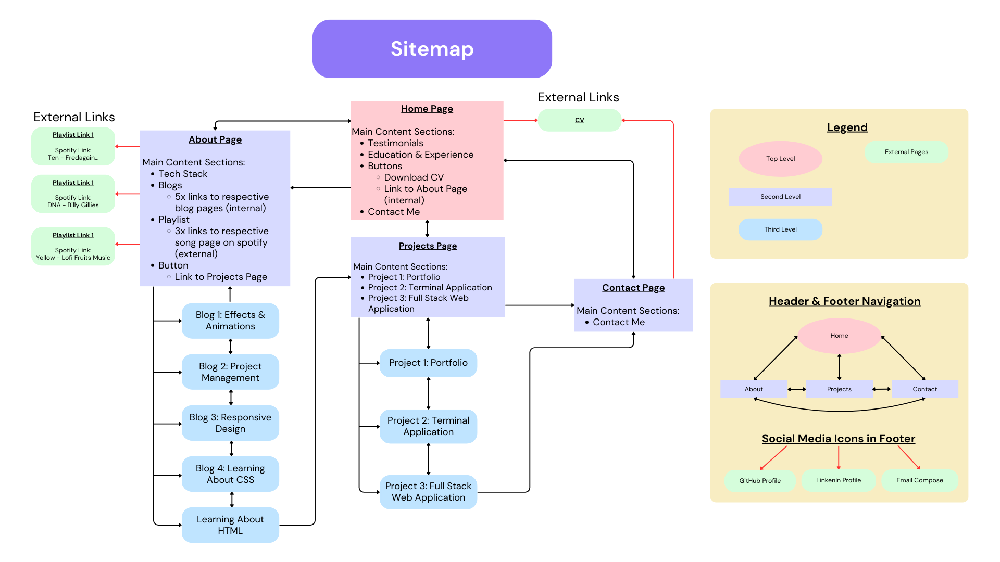

# HendricWidjaja_T1A2

Welcome to the documentation of Hendric Widjaja’s - T1A2: Portfolio Assignment.

# Quick Links

Please use the links below to access the Portofolio Website & respective GitHub Repository:

- [Click here to go to the published portfolio website](https://hendric-widjaja-t1a2-portfolio.netlify.app/)
- [Click here to go to the GitHub repository for HendricWidjaja_T1A2](https://github.com/hendricwidjaja/HendricWidjaja_T1A2)

Please use the links below to view the wireframes for the Portfolio Website (via Figma).
- [Mobile View - iPhone 14 & 15 Pro Max](https://www.figma.com/proto/cvTiWqzyS9wXXfKHesrNJt/T1A2%3A-Portfolio?node-id=0-1&t=VoGTyJiuwAJxmtRi-1)
- [Tablet View - iPad Pro 11"](https://www.figma.com/proto/cvTiWqzyS9wXXfKHesrNJt/T1A2%3A-Portfolio?node-id=107-492&t=VoGTyJiuwAJxmtRi-1)
- [Laptop View - Macbook Air](https://www.figma.com/proto/cvTiWqzyS9wXXfKHesrNJt/T1A2%3A-Portfolio?node-id=107-493&t=VoGTyJiuwAJxmtRi-1)

Please use the link below to view the sitemap for the Portfolio Website (via Canva)
- [Click here to go to the Canva public view link for the Portfolio Sitemap](https://www.canva.com/design/DAGG64AlKZ4/w3qsl1A4A7-sUO23D39DLQ/view?utm_content=DAGG64AlKZ4&utm_campaign=designshare&utm_medium=link&utm_source=editor)

<b>NOTE:</b> The sitemap only covers links within the content of each page. All <u>internal</u> links include a navigation bar in both the header and footer to allow the user to switch to any of the core pages from any internal page (see Header & Footer Navigation note on Sitemap). 

# Purpose
The purpose of creating this website was to act as a portfolio that can be presented to potential employers to showcase the expertise and experience I have as (an aspiring) full stack web developer and IT professional. This involved providing information regarding my skill set, expertise and qualifications through:
- Work Experience (Link to Resume/CV)
- Educational History
- Completed/in progress projects
- Testimonials

It was also important to show employers content regarding my personality and interests. This was attempted to be highlighted through:
- Blog posts
- Website theme/style
- Text content
- Miscellaneous (e.g. playlist)

# Sitemap

This sitemap was created using canva to 

## Structure
The 

# Wireframes
There are 12x wireframes for each viewport ([mobile](./docs/wireframes-mobile/), [tablet](./docs/wireframes-tablet/) and [laptop](./docs/wireframes-laptop/)). Therefore a total of 36 wireframes were made to provide an idea of how the layout of each component will change when viewing from different viewports. A .png of each wireframe for each viewport can be located in their respective folder within the /docs directory (HendricWidjaja-t1a2/docs). Please view these files in conjunction when reading this wireframes overview.
